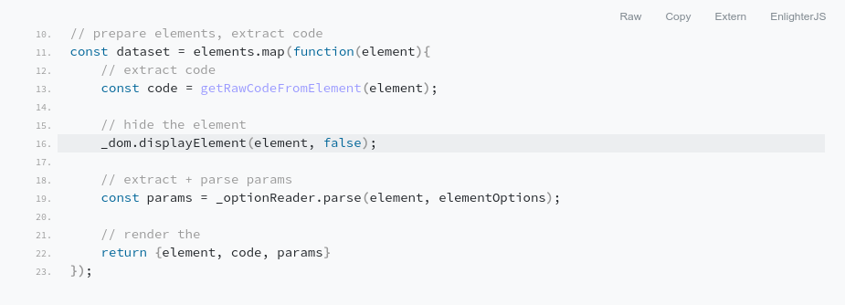

[](https://travis-ci.org/EnlighterJS/EnlighterJS)

[Quickstart](#quickstart) | [Documentation](https://github.com/EnlighterJS/docs) | [Languages](#languages) | [Themes](#themes) | [Website](https://enlighterjs.org) 

EnlighterJS3
====================================================================

**EnlighterJS, an open source syntax highlighter written in pure javascript**

Using it can be as simple as adding a single script and style to your website, choosing the elements you wish to highlight, and EnlighterJS takes care of the rest.



Related
----------------------------------------------

* [Documentation](https://github.com/EnlighterJS/docs)
* [Website](https://enlighterjs.org)
* [Developer Guide](https://github.com/EnlighterJS/documentation/blob/master/development/README.md)
* [Examples](examples/)
* [EnlighterJS for WordPress](https://wordpress.org/plugins/enlighter/) - The official EnlighterJS plugin for WordPress | [Repository](https://github.com/EnlighterJS/Plugin.WordPress)
* [EnlighterJS for TinyMCE Editor](https://tinymce.enlighterjs.org) - The official EnlighterJS plugin for TinyMCE Visual Editor | [Repository](https://github.com/EnlighterJS/Plugin.TinyMCE)
* [EnlighterJS for Gutenberg Editor](https://wordpress.org/plugins/enlighter/) - The official EnlighterJS plugin for WordPress Gutenberg Editor| [Repository](https://github.com/EnlighterJS/Plugin.Gutenberg)

Features
----------------------------------------------

#### KEY FEATURES ####

* Designed to work in **all modern browsers** (not server-side)
* Encapsulated, standalone library - **zero dependencies** (no MooTools, no jQuery!)
* 40 supported languages/formats
* 12 high quality themes
* Inline Syntax highlighting
* Codegroups to displays multiple code-blocks within a tab-pane
* Point out special lines of code
* Ultra small footprint: `45KB JS` (all languages) + `10KB CSS` (single theme; all themes 60KB)
* Highlight all codeblocks on your page with a single command

#### TECHNICAL FEATURES ####

* Ultrafast Tokenizer Engine based on priorized regular expressions
* Second-Stage-Tokenizer for optimized performance 
* Full customizable themes written in [less](http://lesscss.org/)
* Themes available as single css files to reduce footprint
* Views based on [JSX](https://reactjs.org/docs/introducing-jsx.html)
* Minimal, embedded DOM library
* [gulp](https://gulpjs.com/) based build system
* ES6 code transpiled via [babel](https://babeljs.io/) and build with [rollup.js](https://rollupjs.org/guide/en)

#### Languages ####

* **ABAP** (abap)
* **Apache HTTPD** (apache)
* **Assembly** (assembly, asm)
* **AVR Assembly** (avrassembly, avrasm)
* **Windows Batch/Bat** (bat,batch,cmd)
* **C/C++** (c,cpp, c++)
* **C#** (csharp)
* **CSS** (css)
* **Cython** (cython)
* **CordPro** (cordpro)
* **diff** (diff)
* **Dockerfile** (docker, dockerfile)
* **Generic** (generic, standard) - default highlighting scheme
* **Groovy** (groovy)
* **Go** (go, golang)
* **HTML** (html)
* **Ini** (ini, conf)
* **Java** (java)
* **Javascript** (js, javascript, jquery, mootools, ext.js)
* **JSON** (json)
* **JSX** (jsx)
* **Kotlin** (kotlin)
* **LATEX** (latex)
* **LESS** (less)
* **lighttpd** (lighttpd)
* **LUA** (lua)
* **MariaDB** (mariadb)
* **Markdown** (gfm, md, markdown)
* **Matlab/Octave** (octave, matlab)
* **MSSQL** (mssql)
* **NGINX** (nginx)
* **NSIS** (nsis)
* **Oracle Database** (oracledb)
* **PHP** (php)
* **Powerhsell** (powershell)
* **Prolog** (prolog)
* **Python** (py, python)
* **PureBasic** (purebasic, pb)
* **QML** (qml)
* **R** (r)
* **RAW** (raw) - raw code without highlighting with EnlighterJS container styles!
* **RouterOS/SwitchOS** (routeros)
* **Ruby** (ruby)
* **Rust** (rust)
* **Scala** (scala)
* **SCSS** (scss, sass)
* **Shellscript** (shell, bash)
* **Generic SQL** (sql)
* **Squirrel** (squirrel)
* **Swift** (swift)
* **Typescript** (typescript)
* **VHDL** (vhdl)
* **VisualBasic** (visualbasic, vb)
* **Verilog** (verilog)
* **XML** (xml, html)
* **YAML** (yaml)

#### Themes ####

* **Enlighter** (enlighter, standard) - Enlighter`s default Theme
* **Classic** (classic) - SyntaxHighlighter inspired
* **Bootstrap** (bootstrap4) - Bootstrap 4 inpired themes, high contrast
* **Beyond** (beyond) - BeyondTechnology Theme
* **Godzilla** (godzilla) - A MDN inspired Theme
* **Eclipse** (eclipse) - Eclipse inspired
* **MooTwo** (mootwo) - Inspired by the MooTools Website
* **Droide** (droide) - Modern, minimalistic
* **Minimal** (minimal) - Bright, High contrast
* **Atomic** (atomic) - Dark, Colorful
* **Dracula** (dracula) - Dark, using official [draculatheme](https://draculatheme.com/) colorscheme
* **Rowhammer** (rowhammer) - Light, Transparent, divided rows

Quickstart
----------------------------------------------

1. Download latest [EnlighterJS release](https://github.com/EnlighterJS/EnlighterJS/releases)
2. Copy the files from the `dist/` directory to your public html location
3. Include the CSS+JS files
4. Tag the codeblocks on your page (e.g. `pre` tags with `data-enlighter-language` attribute)
5. Initialize highlighting

### Minimal Example ###

This is a minimalistic example how to highlight sourcecode with EnlighterJS. The working example (valid js+css paths) is available within the [example directory](examples/).

```html
<!DOCTYPE html>
<html lang="en">
<head>
    <meta charset="utf-8" />
    <meta name="viewport" content="width=device-width, initial-scale=1" />
    <title>EnlighterJS Test</title>

    <!-- EnlighterJS Resources !-->
    <link rel="stylesheet" href="enlighterjs.min.css" />
</head>
<body>

    <main>
        <p>Lorem ipsum dolor sit amet, consetetur sadipscing elitr, sed diam nonumy eirmod tempor invidunt ut labore 
            et dolore <code>window.addEvent('domready', async (a,b) => {});</code> magna aliquyam erat.
        </p>

        <!-- Code to hghlight !-->
        <pre data-enlighter-language="less">
// buttons used in codegroups + toolbar
.enlighter-btn{
    display: inline-block;
    margin: 0px 5px 0px 5px;
    padding: 3px 5px 3px 5px;
    border: solid 1px #333333;
    background-color: #f0f0f0;
    cursor: pointer;
}

// buttons
.enlighter-btn-raw{
    background-image: data-uri('icons/enlighter_code.svg');
}

.enlighter-btn-window{
    background-image: data-uri('icons/enlighter_rawcode.svg');
}

.enlighter-btn-website{
    background-image: data-uri('icons/enlighter_icon_white.svg');
}
        </pre>

    </main>

    <script type="text/javascript" src="enlighterjs.min.js"></script>
    <script type="text/javascript">
        // INIT CODE - simple page-wide initialization based on css selectors
        // - highlight all pre + code tags (CSS3 selectors)
        // - use javascript as default language
        // - use theme "enlighter" as default theme
        // - replace tabs with 2 spaces
        EnlighterJS.init('pre', 'code', {
                language : 'javascript',
                theme: 'enlighter',
                indent : 2
        });
    </script>
</body>
</html>
```

Contribution
------------

EnlighterJS is OpenSource and managed on [GitHub](https://github.com/EnlighterJS/EnlighterJS) - if you like, you're welcome to contribute!
To simplify the release and quality control process, please follow these remarks:

1. **One Enhancement** _==>_ **One Commit** (don't merge a bunch of changes in a single commit!)
2. Only commit changes to the `src/` or `examples/` directory. Otherwise your request will be rejected
3. Discuss larger project changes with the Maintainer **before implementing**
4. Use GitHub for question, bugreports and discussions

License
----------------------------------------------

EnlighterJS is OpenSource and licensed under the Terms of [Mozilla Public License 2.0](https://opensource.org/licenses/MPL-2.0). You're welcome to [contribute](docs/CONTRIBUTING.md)

